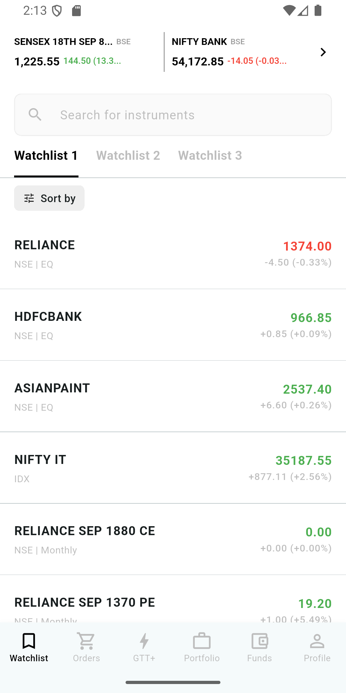
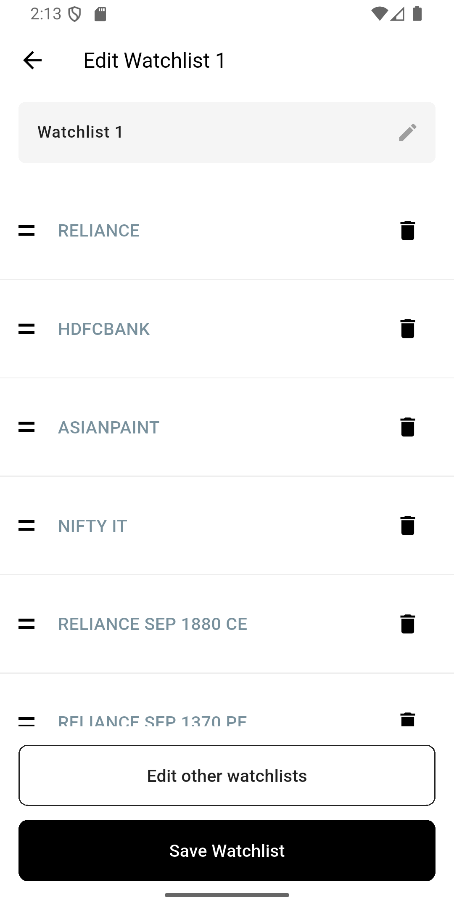
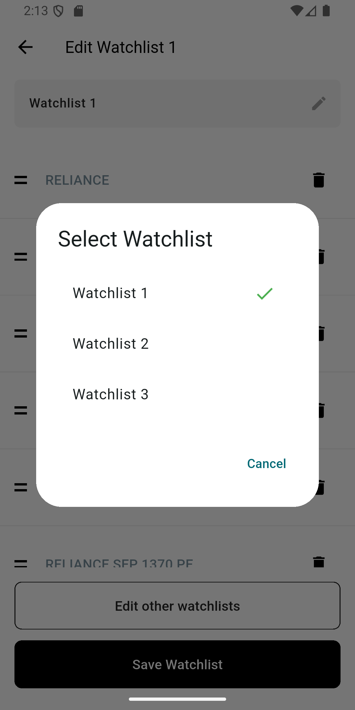

# Task 021trade - Watchlist Management App

A Flutter application for managing stock watchlists with real-time data visualization, reordering capabilities, and seamless navigation between watchlists.

## 📱 Features

### Core Functionality
- **Multiple Watchlists**: Create and manage multiple watchlists with different stock arrangements
- **Stock Management**: Add, remove, and reorder stocks within each watchlist
- **Search Functionality**: Quick search across stocks in your watchlists
- **Edit Mode**: Dedicated screen for watchlist editing with drag-and-drop reordering

### User Interface
- **Clean Design**: Modern, intuitive interface with Material Design principles
- **Responsive Layout**: Optimized for mobile devices with proper spacing and typography
- **Interactive Elements**: Smooth transitions and touch-friendly controls
- **Visual Feedback**: Clear indicators for stock movements and watchlist selection

## 🏗️ Architecture

### State Management
- **BLoC Pattern**: Uses Flutter BLoC for predictable state management
- **Event-Driven**: Clean separation between UI and business logic
- **Reactive Updates**: Real-time UI updates based on state changes

### Data Layer
- **WatchlistData Model**: Centralized data management with singleton pattern
- **Stock Model**: Structured stock data with exchange types and pricing
- **Persistent Storage**: In-memory storage with easy persistence extension points

### Widget Architecture
- **Modular Components**: Separated widgets for reusability and maintainability
- **Custom Widgets**: Specialized widgets for watchlist-specific functionality
- **Responsive Design**: Adaptive layouts for different screen sizes

## 📸 App Screenshots
<p align="center">
  
  
  
</p>
### Main Watchlist Screen


The main screen displays:
- Market indices (SENSEX, NIFTY BANK) with real-time data
- Search bar for filtering stocks
- Watchlist tabs for easy switching
- Sortable stock list with price movements
- Bottom navigation for app navigation

### Edit Watchlist Screen


The edit screen provides:
- Watchlist name editing with inline updates
- Drag-and-drop stock reordering
- Stock deletion with confirmation dialogs
- Watchlist selection for editing other lists
- Save functionality with confirmation

### Stock Reordering Interface


Reordering features include:
- Touch-friendly drag handles
- Visual feedback during reordering
- Smooth animations
- Persistent order changes

## 🚀 Getting Started

### Prerequisites
- Flutter SDK (>= 3.10.4)
- Dart SDK
- Android Studio / VS Code with Flutter extensions


## 📁 Project Structure

```
lib/
├── bloc/                    # State management
│   ├── watchlist_bloc.dart
│   ├── watchlist_event.dart
│   └── watchlist_state.dart
├── models/                  # Data models
│   ├── stock.dart
│   └── watchlist_data.dart
├── screens/                 # Screen widgets
│   ├── watchlist_screen.dart
│   └── edit_watchlist_screen.dart
├── widgets/                 # Reusable components
│   ├── index_tile.dart
│   ├── search_bar_widget.dart
│   ├── watchlist_tabs.dart
│   ├── sort_header.dart
│   ├── stock_list.dart
│   ├── bottom_nav_bar.dart
│   ├── empty_state_widget.dart
│   ├── watchlist_name_field.dart
│   ├── reorderable_stock_list.dart
│   └── edit_watchlist_bottom_buttons.dart
└── main.dart               # App entry point
```

## 🎯 Key Features Explained

### Watchlist Management
- **Multiple Lists**: Create unlimited watchlists with custom names
- **Stock Organization**: Arrange stocks in preferred order for each watchlist
- **Quick Switching**: Seamless navigation between different watchlists
- **Data Persistence**: Watchlist configurations are maintained across sessions

### Stock Information
- **Exchange Types**: Support for different market exchanges (NSE, IDX, Monthly)
- **Search & Filter**: Quick access to specific stocks

### User Experience
- **Intuitive Navigation**: Clear visual hierarchy and predictable interactions
- **Responsive Feedback**: Immediate response to user actions
- **Error Handling**: Graceful handling of edge cases and user errors
- **Performance**: Optimized for smooth scrolling and quick data loading

## 🔧 Technical Implementation

### BLoC Pattern Implementation
```dart
// Example of state management
class WatchlistBloc extends Bloc<WatchlistEvent, WatchlistState> {
  final WatchlistData _watchlistData = WatchlistData();
  
  void _onLoadWatchlist(LoadWatchlist event, Emitter<WatchlistState> emit) {
    emit(WatchlistLoading());
    _watchlistData.initialize();
    // ... state emission logic
  }
}
```

### Widget Composition
```dart
// Example of modular widget usage
class WatchlistScreen extends StatelessWidget {
  @override
  Widget build(BuildContext context) {
    return Scaffold(
      body: Column(
        children: [
          const SearchBarWidget(),
          WatchlistTabs(watchlists: watchlists),
          const SortHeader(),
          Expanded(child: StockList(stocks: stocks)),
        ],
      ),
    );
  }
}
```

## 📊 Data Models

### Stock Model
```dart
class Stock {
  final String name;
  final ExchangeType exchange;
  final double price;
  final double change;
  final double changePercentage;
  final bool isPositive;
}
```

### Watchlist Data Management
```dart
class WatchlistData {
  static final WatchlistData _instance = WatchlistData._internal();
  factory WatchlistData() => _instance;
  
  void addWatchlist(String name, List<Stock> stocks);
  void reorderStocks(String watchlistName, int oldIndex, int newIndex);
  List<Stock> getStocksForWatchlist(String watchlistName);
}
```

## 🎨 Design System

### Color Palette
- **Primary**: Black and white for clean, professional look
- **Secondary**: Grey tones for subtle visual hierarchy
- **Accent**: Green for positive changes, red for negative movements

### Typography
- **Headings**: Bold, clear fonts for section titles
- **Body Text**: Readable fonts for stock information
- **Interactive Elements**: Consistent sizing for touch targets

### Spacing
- **Consistent Padding**: 16dp standard for content areas
- **Component Spacing**: 8dp for tight groupings, 16dp for sections
- **Touch Targets**: Minimum 44dp for interactive elements

## 🔄 State Flow

1. **App Initialization**: Load watchlist data from WatchlistData
2. **Screen Display**: Show main watchlist with current selection
3. **User Interaction**: Handle taps, drags, and input events
4. **State Updates**: Update BLoC state based on user actions
5. **UI Refresh**: Rebuild widgets based on new state
6. **Data Persistence**: Save changes to WatchlistData model

## 🚀 Performance Optimizations

- **Lazy Loading**: Load data only when needed
- **Efficient Rebuilding**: Minimize widget rebuilds with proper state management
- **Memory Management**: Clean disposal of controllers and listeners
- **Smooth Animations**: Optimized transitions and drag operations

## 🛠️ Development Tools

### Recommended VS Code Extensions
- Flutter
- Dart
- BLoC
- Flutter Widget Snippets

### Useful Commands
```bash
# Hot reload during development
flutter run --hot

# Check for issues
flutter doctor

# Update dependencies
flutter pub upgrade
```

## 📱 Platform Support

- **Android**: Fully supported with Material Design
- **iOS**: Compatible with Cupertino adaptations
- **Web**: Responsive design for desktop browsers
- **Desktop**: Support for Windows, macOS, and Linux

## 🤝 Contributing

1. Fork the repository
2. Create a feature branch
3. Make your changes
4. Add tests for new functionality
5. Submit a pull request

## 📄 License

This project is licensed under the MIT License - see the LICENSE file for details.

## 🙏 Acknowledgments

- Flutter team for the amazing framework
- BLoC library for state management
- Material Design guidelines for UI inspiration
- Flutter community for continuous support and learning resources

---

**Built with ❤️ using Flutter**
